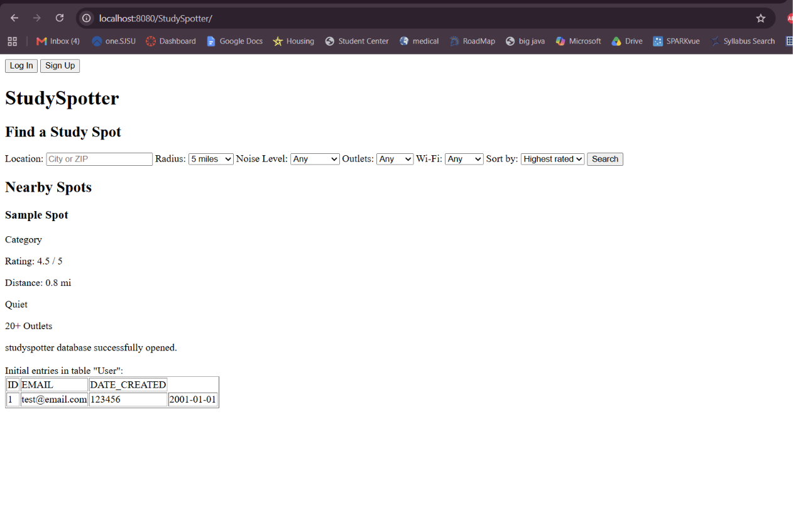

# CS157A-Team1

## StudySpotter
Team members: Julia Husainzada, Janet Chiem, Jay Timbol

to get the database to connect (currently), copy index.jsp into your tomcat ROOT folder in a new directory called StudySpotter. in this, for experiments, u can then add ur passwords and stuff in the tomcat index.jsp. do not commit this to github
use the sql file to add the studyspotterdb into workbench & fix any discrepancies in the files...

StudySpotter is a web platform where users such as students and business owners can share and find accessible or hidden study locations near school campuses and local areas from a simple search through a constantly updated database. Sometimes, places can get too crowded and loud, not have enough seating, have a lack of outlets, and generally feel uncomfortable for students who need space to work. Students walk around aimlessly trying to find the perfect spot to study, only to waste their working time walking around, and in some occasions, never finding the right spot, settling for less than they deserve as the futures of humanity. StudySpotter will try to eliminate this time drain by making it easy and efficient for students to find not just the space they need, but a place they will want to spend their time working in. 

The primary goal of this project is to help students in need of a good study spot find the right place where they can be productive and use their potential to the fullest. The system will collect data on noise levels, menu items, seating availability, outlet count, and the quality of the environment. Users will also be able to contribute by adding data into the databases about these study spots as fellow students or verified business owners. This will help people in need of a good place to find one quickly and easily that fits their preferences through a quick search, and help local businesses, parks and more promote their spaces. 

Major stakeholders include students, who can connect, read, and share locations right for studying, and business owners, who manage spots such as cafes, gardens, libraries, and so on. 

The innovation of this platform is to make studying more accessible and to create a community of students, for students, by students. 

